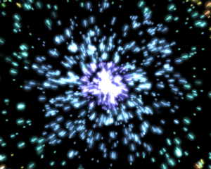

Wasn't in the mood this weekend to work on my current flash project, or  any other web projects, so I decided to mess around with the [TAO framework](http://www.taoframework.com/ "Tao Framework"). I made a game about a year ago called Glow Roids (the name is pretty comical when you think about it) using [CsGL](http://www.google.com/url?sa=t&source=web&ct=res&cd=1&url=http%3A%2F%2Fcsgl.sourceforge.net%2F&ei=GTyiScurK9-BtwfbwMGODQ&usg=AFQjCNFdSA6QNRbAQzkW3XVs6_SbKiPxsQ&sig2=GCRprq-UGCGQ-vyvfMXYww "CSGL"). I had a bunch of problems with it on different machines, mostly involving ATI cards, and Vista. So I decided to try out OpenGL with C# again only this time using the Tao framework. So far it seems to work pretty well on all the machines I've tried it on.

Really all I did was end up converting some of the Nehe lesson 19 code, and then making my own sprite class. Soon I'll make an emitter class so I can have a full featured particle system up and running to eventually make some sort of game. Anyway [here is](http://www.loktar.com/files/bigbang.zip "Big Bang") the fruits of my labor a crazy particle effect that makes me think of the big bang.

Ill release the source if anyone really wants it. I warn you its not the prettiest!

[Download Zip](http://www.loktar.com/files/bigbang.zip "Big Bang Zip")
