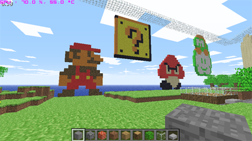
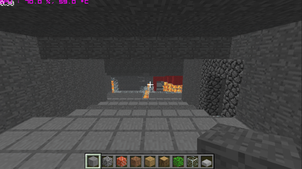

Recently came across this awesome java game [Minecraft](http://minecraft.net) basically the whole goal of the game (multiplayer that is) is to create and destroy things. At first I was pretty skeptical, the concept is so simple.. until I found myself spending hours recreating Mario, and others pixel by pixel, and creating a staircase to lava.

\[caption id="attachment\_207" align="aligncenter" width="426" caption="Mario brothers in Minecraft"\]\[/caption\]

\[caption id="attachment\_208" align="aligncenter" width="426" caption="Stairs to Lava"\]\[/caption\]

Don't let the look of the game fool you, anyone no matter the age group can easily become addicted.

What really piqued my interest are some of the game modes people have put together, such as a zombie mode where you are chased by zombies (other players who have been turned) and you need to either hide, or build your way away from them. Theres also a falling lava mode where lava fills the level and you need to build structures as to not get stuck in it.

What I really wanted to do was create some of my own game modes, but it was pretty hard to even figure out where to begin. I eventually settled on [Opencraft](http://opencraft.sourceforge.net/), which is an opensource Java server for the game. It looks like development has ceased so I have had to implement a few things already. I plan on releasing any changes I make so others can create some interesting game modes as well.
