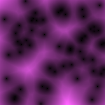
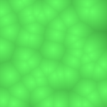
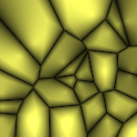
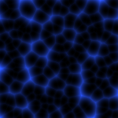

Been messing with canvas again, and put together a little demo that creates procedural cell looking textures, based off of the Worley algorithm. You can achieve some pretty amazing results, also added the option to animate, but since the algorithm has not been optimized yet you have to keep the dimensions and number of points low. Also need to implement tiling. Heres a few examples of what you can produce with some minor changes in distance calculation for points. [You can check out the generator here.](http://somethinghitme.com/projects/cell/ "Worley Texture Generator")

