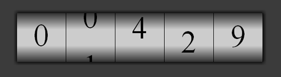

So I decided to try out webkits css3 animations. Been seeing cool things crop up lately and I wanted to try my hand at doing my own animations, and see what they are capable of. I came up with a timed rotary counter. The below example uses no images, or javascript, its all css. I cant wait until this is standard.. no more clunky markup for shadows, or creating gradients in photoshop.

[Project Link](http://www.somethinghitme.com/projects/rotary/)

Overall the webkit css animations aren't that difficult. The trickiest part was giving the illusion of the counter looping around. I just did this by adding a 0 at the end of the element, and changing the top position back to the original value at the end of the animation.
