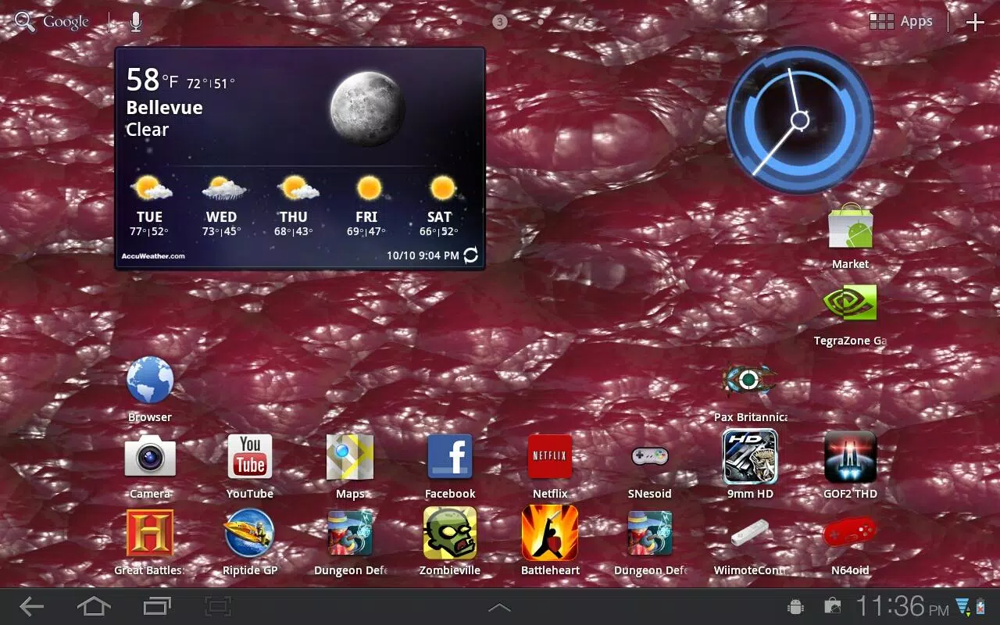
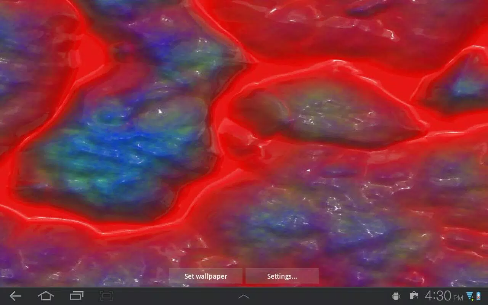

Just released [my second live wallpaper, Guts and Goo](https://market.android.com/details?id=com.loktar.particleswirl&feature=search_result)

Used [libgdx](http://www.badlogicgames.com/wordpress/) along with the [libgdx live wallpaper backend](http://code.google.com/p/libgdx-backend-android-livewallpaper/). Was a fun project, found out about an awesome filter library while making it, its what allowed for such great high res nasty images.

The hardest thing besides a bit of OpenGL I had to learn was the Android preferences. I dont know why but I have such a hard time getting them working right. So right now the only option is to pick different images to mess with. I plan on adding more later. I also plan on releasing a "lite" version which only includes one background to choose.
