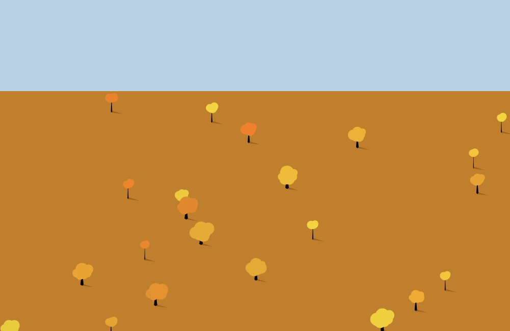

The idea is \*heavily\* inspired by a [JS1K demo submission](http://js1k.com/2011-dysentery/demo/994 "Forest Scene") that was done by @daisyowl. 

 I just thought the demo was so cool it was begging to be a live wallpaper. I plan on adding more features such as clouds/different seasons etc. Heres a link to the source if anyones interested, [https://github.com/loktar00/Android-Forest-LWP](https://github.com/loktar00/Android-Forest-LWP) and heres the link to it on the app market, [https://market.android.com/details?id=com.loktar.forestscenes&feature=search\_result](https://market.android.com/details?id=com.loktar.forestscenes&feature=search_result)

[And here's my recreation in JS](https://loktar00.github.io/demos-and-deviations/demos/animated%20tree%20scene/)
