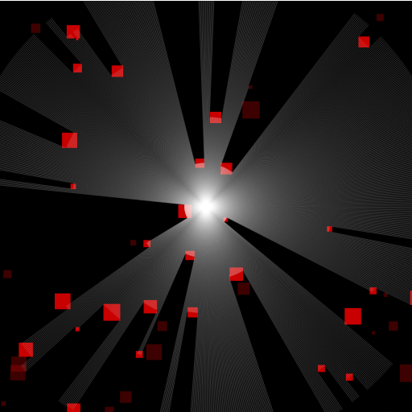
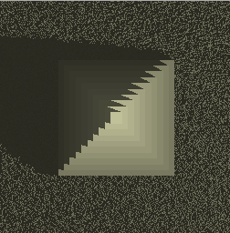

Just started messing with realtime 2d raycasting for lighting today, used a pretty good code example from [facepunch.com/threads/1011659](http://www.facepunch.com/threads/1011659). [Heres my version in JS](http://www.somethinghitme.com/projects/2d%20lighting/fakelight.html), and [a fiddle to play with](http://jsfiddle.net/loktar/VY75L/16/). If you look at the code you'll notice I added a portion to keep track of the closest block per ray so you can light up only that block and not the others. However doing this got me to thinking, this method can be used to make a vision cone for AI. Ive seen this raycasting method used before I just never implemented it myself.. besides my \*really\* slow implementation for lighting on my [canvas terrian.](http://www.somethinghitme.com/projects/canvasterrain/)

I might mess with this some more, got a few ideas for a small game or two, but who knows if I'll actually get around to it before finding something else that's shiny. Feel free to do whatever with the code. There's a lot of room for optimization.

Figured I might as well post this thing I was messing around with. [Same concept but much slower](http://jsfiddle.net/loktar/PyW5d/19/) .

