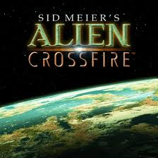
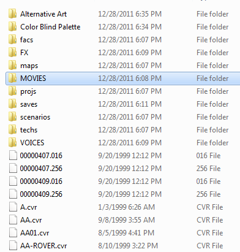

This is kind of a random post, but its something I ran into this week on vacation after getting a copy of Soldout Softwares Alpha Centauri with the Alien Crossfire expansion pack. If you're like me and tried installing the game from the cd, the setup.exe just hangs. But never fear there is a way to get it working!

**Step 1** - Make a directory somewhere on your machine, but not in program files, or program files(x86). Otherwise in order to save you will have to run the game as an administrator. What I did was create a directory structure on the root of my drive "DRIVE:\\Firaxis\\Sid Meier's Alpha Centauri\\".

**Step 2** \- Copy the contents of the "programs" directory from Disc 1 to the directory we created above. Now copy the Directories FX, MOVIES, and VOICES into the directory. Now your structure should look something like the following,

Now do the same with CD2, copy the contents of programs to the root of the same directory and then copy FX/MOVIES/VOICES, and just acknowledge the file overwrites. At this point you now have a "working" copy of the game, you just run Terran.exe, or Terranx.exe in order to play, but you will probably have a few odd issues with windows not appearing, and low resolution. So I recommend you follow the rest of the directions posted at [this forum]( http://forums.2kgames.com/showthread.php?112816-SMAC-on-Win-7-64-bit) (2nd post).

In case the above forum post is deleted or something I wanted to have the info here as well, but I encourage trying the link above first.

> I run Alpha Centauri and it's expansion Alien Crossfire on Windows 7 64-bit with no problems. However the following are a few of the things I've had to do to make them work the best they can:
>
> Once you apply the Windows XP Compatibility patch then you are almost good to go for Windows 7 64-bit. If you are getting an error message then try to re-download that patch or run the patch itself in a compatibility mode perhaps with the "run as administrator" option.
>
> You are _almost_ ready to go. Before you even install **any** patches first make sure the installation folder is not within either the "Program Files" or "Program Files (x86)" folders. This is because Alpha Centauri (and Alien Crossfire) put their save games within their folders. Starting with Vista and newer this will not work because of User Access Control. So, choose an installation folder outside of "Program Files.."
>
> Alpha Centauri's native resolution is 800x600. You can change this however: in the installation folder, find a file named "Alpha Centauri.ini" and open it with NotePad. In that file, Under "\[Alpha Centauri\]" add two lines:
>
> Video Mode=1024 DirectDraw=0
>
> The first line will tell the game to run at 1024x768 which is the maximum resolution using DirectDraw that the game can run with. The second line tells the game to not use DirectDraw and it will instead run at your desktop resolution.
>
> Not done yet!  Alpha Centauri itself (not Alien Crossfire) has a bug when running at your desktop resolution. In the main menu the menu's are not visible. This makes getting into a game practically blind luck. There is a fix however:
>
> If you have Alien Crossfire, get this patch: [Here](http://www.civgaming.net/forums/showthread.php?t=7511). Also get this patch: [Here](http://www.rpgcodex.net/phpBB/viewtopic.php?t=56203). Rename terran.exe and terranx.exe (if you have Alien Crossfire) so you have backup's of them. Then unarchive the first patch into your SMAC folder then unarchive the second into it as well overwriting any files (but keep backups of any overwritten files). You can skip the first archive if you don't have Alien Crossfire. Either of these patches will fix the menu not being visible when using the DirectDraw=0 option. So, you'll be at your desktop resolution and everything will work with these unofficial patches. Both unofficial patches also come with something extra: AI improvements! That is just bonus on top of getting them to work at desktop-resolution!
>
> Almost done! Go back to the "Alpha Centauri.ini" file. Under that put in:
>
> ForceOldVoxelAlgorithm=0
>
> This line if it doesn't already exist. With the unofficial patches you can use "=0" but if you don't use those patches then you will need to set it to "=1" or they will crash.
>
> All of these instructions assume you can get Alpha Centauri to it's last patch: the Windows XP/2000 patch. If you can do that then these instructions just "fix it up" to be the best it can be on a modern system.
>
> If anything is unclear or I can help further just post back. Post back regardless whether you get it working or not!
>
> Also, Alpha Centauri itself is now available on Good Old Games.com here: [Link](http://www.gog.com/en/gamecard/sid_meiers_alpha_centauri). I don't know how well the unofficial patches will work with that version but that version is "turn-key": it's super simple to install and get going!

And enjoy :)
