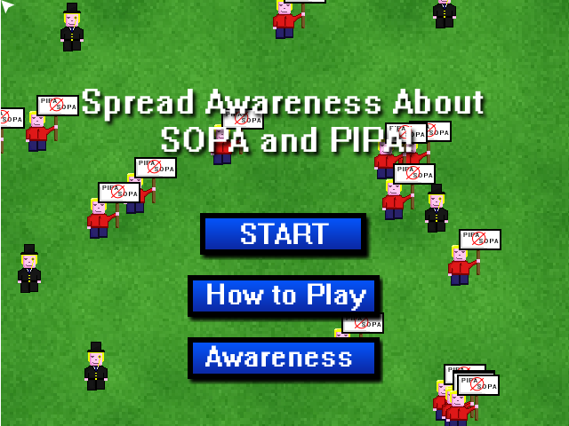

Was pretty stressful trying to make this in a day (especially since I did a full workday at my day job as well!).

[This ended up being my entry](http://www.ludumdare.com/compo/sopajam/?action=preview&uid=10305).

I borrowed some game concepts (ok all of them) from the awesome game World Infectonator. Basically what you do is you get one chance to convert a 1%'er or "the unaware" in hopes they will spread their new found awareness enough to beat the level. Game was done using JS and Canvas of course, and using my homegrown game engine thats been evolving over the last year or so. You can check out the game in all its glory

[from the direct link](http://www.somethinghitme.com/projects/sopa/).
