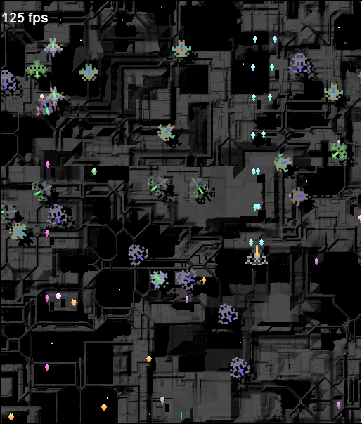

Posting my most current project (well my most current that happens to be cool anyway). Its a canvas shootemup, not really sure what Ill settle on for a title, but heres a screeny

What I think is pretty cool about it so far is all the graphics (except the bg) are procedural and generated based off of whatever seed you give it. Not only are the graphics based on a seed but so is the level. For example if you play game?testing, you will have the same level/graphics as someone else who plays using that seed. This could provide some interesting challenges. Anyway [heres the work in progress](http://www.somethinghitme.com/pprojects/shump/?shmupity) using the seed shmupity.

Also of course this is being done using js/canvas so you need a modern browser to test it.. but I don't think there's many who'd come here without one of those :).
