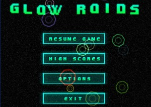
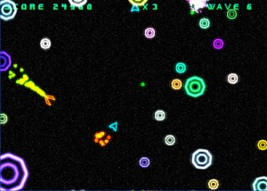
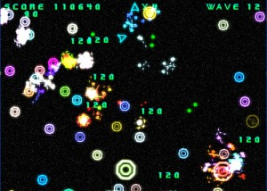

Posting this for archival purposes. Its a game I made a few years back, was really my first foray into C# and OpenGL. I used Tao which to my knowledge isn't updated or used anymore. With that being said the game can be a bit finicky on different machines.

[Original Post](http://www.blitzbasic.com/Community/posts.php?topic=76998)

[Download](http://www.somethinghitme.com/projects/glowroids.zip)
