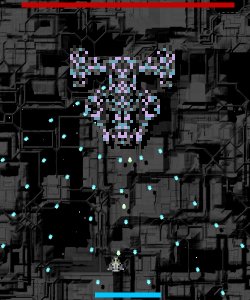

Its crazy how much of a difference music and sounds make. Been working on my shmup when not busy and got a boss in today. So much work still left to be done though, I want upgrades for the player ship still, and possibly a more consistent look for the enemies depending on the seed (like a shared color scheme).

[You can check out my progress here](http://www.somethinghitme.com/pprojects/shump/)
