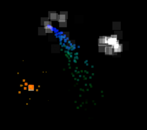

In my attempt to make a post weekly figured I would post some progress on my current project, which is a side project for the shmup Im working on.

Just a basic particle engine using canvas (of course). Its tied in directly with my home grown game framework, so implementing it into my projects should be a breeze. Going to attempt to make an editor for it over the weekend.. heh mostly for me to just mess around, but of course it has the other benefit of allowing me to make effects visually, which is easier. [Check it out](http://www.somethinghitme.com/projects/particle%20test/)
