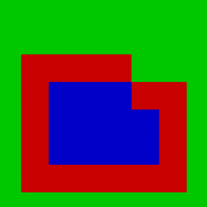

Messing around in JS today (surprising eh?) making an HTML5 vs of rampart-ish. The more I do the less it becomes like rampart. Today I decided to tackle the flood fill portion which is a major part of the gameplay.

Here is the workhorse function

```javascript

function floodFill(mapData, x, y, oldVal, newVal){
    var mapWidth = mapData.length, mapHeight = mapData[0].length;

    if (oldVal == null){
        oldVal=mapData[x][y];
    }

    if (mapData[x][y] !== oldVal){
        return true;
    }

    mapData[x][y] = newVal;

    if (x > 0){
        floodFill(mapData, x-1, y, oldVal, newVal);
    }

    if (y > 0){
        floodFill(mapData, x, y-1, oldVal, newVal);
    }

    if (x < mapWidth-1){
        floodFill(mapData, x+1, y, oldVal, newVal);
    }

    if (y < mapHeight-1){
        floodFill(mapData, x, y+1, oldVal, newVal);
    }
}
```

Which is called by doing this

```javascript
    floodFill(map, 3,3,null,2);
```

map refers to a 2 dimensional array which contains the data, in my case, 0 or 1. The second 2 parameters are the x and y of where to start on the map, null is the initial value to start with, and 2 is the change value parameter, which tells the function to change any tile with the value 0, to 2.

The function is pretty straightforward it recursively checks each points north/south/east/west neighbor until it encounters a neighbors whos value is not 0. [Try the code for yourself](http://jsfiddle.net/loktar/ZLw9m/). I have portions commented out that generate a larger random map to fill for testing purposes. Anything beyond 256x256 has issues within chrome due to stack size restrictions.

Below is the result of the function.

[](http://www.somethinghitme.com/wp-content/uploads/2012/03/filled.png)

[And here is a link to some great information on recursive floodfilling](http://inventwithpython.com/blog/2011/08/11/recursion-explained-with-the-flood-fill-algorithm-and-zombies-and-cats/)
