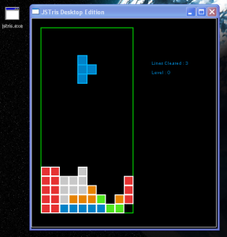

This is something I've been looking to do for the longest time. The closest I ever got was using Adobe Air. I didn't like that solution though because it left all of your assets out in the open. Recently a friend reminded me about [QT](http://qt.nokia.com/products/) something I haven't touched in a few years. After looking over some of their webkit examples I realized I could load in embedded resources.. making self contained canvas games.

I tested out my theory using the Fancy Browser sample, and just modifying it to load an embedded html, which include all the code for the game.

So far it works great. I need to do some more tests, such as finding out what dependencies the executable requires, and also what kind of performance I get (QT5 will include V8). This is still pretty cool in my opinion, just another way to monetize HTML5 games :).... or even... HTML5 screen savers!
