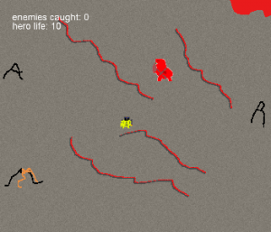
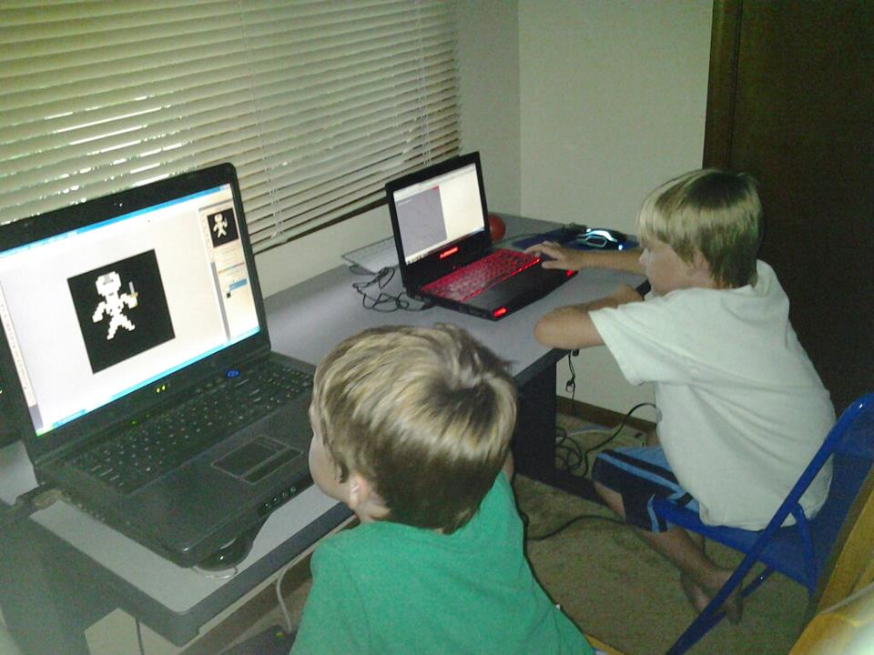

My son Jacob decided to learn how to program. He followed the [great tutorial from Lost Decade Games](http://www.lostdecadegames.com/how-to-make-a-simple-html5-canvas-game/), and added his own flare to it. He added enemies that shoot, player health, and the game can also end. So proud of him for making it. I helped with a few small things, but the majority was done by him. His brother Gavin also helped with art along with their sister Gabi.

Check out [Dark Slayer](http://www.somethinghitme.com/projects/darkslayer/)

