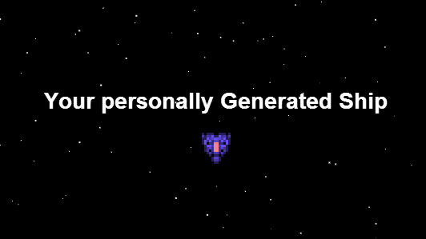

I decided to create a small project this weekend, using node, and [nodejitsu.com](http://nodejitsu.com). The concept was really simple, to generate a 2d ship that could be used in games, or any programs really. The project turned out pretty well check out [http://retroships.com/](http://retroships.com/). The ships are generated via node-canvas, and displayed to the user. The stars are done with standard client side canvas. I'm sure I'll be creating a few more micro sites like this, and possibly a full on app for procedural graphic generation at some point.

As for retroships.com features there's a few more things I need to add such as the ability to pick different ship styles, an option for seeds, and the ability to get only the ship graphics from a simple url such as retroships.com/generate?type=2&seed=blah.

As for using nodejitsu, its great, setup was \*really\* simple. I'm looking forward to the paid tiers so I don't have to worry about my site just suddenly ceasing to function. The only issue I had was with deploys. I had to deploy 2-3 times due to errors with node-canvas.
