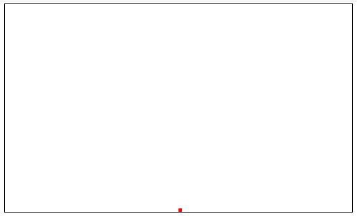

I've seen a few questions on [Stackoverflow](https://stackoverflow.com "stackoverflow") lately dealing with how to smoothly move an object around on the canvas. This will be the first part, of my first ever attempted tutorial series. So please bear with me as I can sometimes be very confusing (to myself included) when trying to convey any topics dealing with development.

## What we will be making
<iframe height="386" style="width: 100%;" scrolling="no" title="Part 1 platformer tutorial" src="https://codepen.io/loktar00/embed/jHwBL?height=386&theme-id=690&default-tab=result" frameborder="no" allowtransparency="true" allowfullscreen="true">
  See the Pen <a href='https://codepen.io/loktar00/pen/jHwBL'>Part 1 platformer tutorial</a> by Loktar
  (<a href='https://codepen.io/loktar00'>@loktar00</a>) on <a href='https://codepen.io'>CodePen</a>.
</iframe>

## What do I need to know?

What do you need to know before reviewing this tutorial? Not much really, a pretty basic understanding of JavaScript is required, and know what the [canvas](https://developer.mozilla.org/en-US/docs/HTML/Canvas/Tutorial?redirectlocale=en-US&redirectslug=Canvas_tutorial) element is would be helpful.

## Lets get setup

First lets start out by opening your favorite text editing program. My preferred tool is Sublime Text, but you can use anything, even notepad (although not recommended). Lets go ahead and create a file called game.html and setup the appropriate sections.

In your game.html put the following in.

```html
    <!doctype html>
    <html>
        <head>
            <title>My fancy game</title>
        </head>
        <body>
            <script>
                // All of our JavaScript will go here.
            </script>
        </body>
    </html>
```

## Lets draw something!

We are going to need a few things to start out with. We need a way to track the player object, we need a game loop to update logic and draw onto the screen, and we need to handle user input. So lets get started!

The first thing well do is create the canvas element we're going to use and get something drawn on it.

Use following markup to create the canvas element. Make sure to place it before the script tag in the html file we created.

```html

<canvas id="canvas" style="border:1px solid #000"></canvas>

<script>
    // All of our JavaScript will go here.
</script>
```

I was also very bad and added an inline style to our canvas element. It allows us to see where its actually at on the page. As a caveat however this is a tutorial on creating a game with JavaScript and canvas, not a web standards tutorial.

Now add some JavaScript to get the player onto the screen. This will go between the script tags, right in the area that says

**//All of our JavaScript will go here**.

```js
    var canvas = document.getElementById("canvas"),
        ctx = canvas.getContext("2d"),
        width = 500,
        height = 200,
        player = { x : width / 2, y : height - 5, width : 5, height : 5 };

    canvas.width = width; canvas.height = height;

    // draw a small red box, which will eventually become our player.
    ctx.fillStyle = "red";
    ctx.fillRect(player.x, player.y, player.width, player.height);

```

You can now test your file. To do that double click your html file, it should open up in your web browser by default. From now on everytime you want to test a change you can just refresh your page.

If you run what you have you should have something that looks like the following.

[](https://www.somethinghitme.com/2013/01/09/creating-a-canvas-platformer-tutorial-part-one/tut1-1/)

AWW YEAH GOT SOMETHING ON SCREEN!

Ok maybe I'm too excited about that I don't know, regardless your dude is on the screen and I can tell he wants to get moving.

## The game loop and requestAnimationFrame

Now we need to add the game loop! If you're pretty new to canvas and making things move with canvas in particular you may of seen examples using setTimeout, or setInterval. DON'T USE THESE! They were great when that's all we had but for anything that requires constant rendering you want to use [requestAnimationFrame](https://developer.mozilla.org/en-US/docs/DOM/window.requestAnimationFrame). requestAnimationFrame is much better in a few ways, I wont go into all of them [but here is a good place to start reading why you should use it.](http://paulirish.com/2011/requestanimationframe-for-smart-animating/) We will add a shim that was popularized by Paul Irish, which will use requestAnimationFrame on all browsers that support it, and fall back to good ol setTimeout on browsers that do not support it.

Add the following to the top of your js.

```js
    (function() {
        var requestAnimationFrame = window.requestAnimationFrame ||
            window.mozRequestAnimationFrame ||
            window.webkitRequestAnimationFrame ||
            window.msRequestAnimationFrame;
        window.requestAnimationFrame = requestAnimationFrame;
    })();
```

How are you supposed to use it? Its actually quite easy. Lets throw our rendering code into a function, well call it update since we will also place our update logic here as well. Note, this isn't a best practice but we are just doing it for the tutorials sake. Generally your rendering portion, and code that controls entities updating would be seperate so you could add things such as delta timing to control the rendering. However lets keep it simple!

Change the portion in your js that draws your player to the following.

```js
    function update(){
        // runs the loop each time
        requestAnimationFrame(update);
        // draw our player
        ctx.fillStyle = "red";
        ctx.fillRect(player.x, player.y, player.width, player.height);
    }
```

We also need a way to get our game loop kick started, so add a load event listener for the window to the end of your js file.

```js
    window.addEventListener("load", function(){ update(); });
```

Now run the code!!!! It still looks the same doesn't it? Alright lets add something to make it a bit more appealing.

## Handling keyboard input from the user

So now we have our game loop, and our player object, all we need now is a way to get the player moving! We will do this by tracking key presses by the user, and moving our player accordingly.

First we need to add a few more properties to our player object, update your player object to the following.

```js
    player = { x : width/2, y : height - 5, width : 5, height : 5, speed: 3, velX: 0, velY: 0 }
```

As you can see we have added velocity variables for horizontal and vertical movement, and a speed variable. The velocities will be added to our current position, and the speed will control how fast we are able to go.

Next lets add an array named keys right after the player object.

```js
    keys = [];
```

So your variable declarations should now look like this.

```js
    var canvas = document.getElementById("canvas"),
        ctx = canvas.getContext("2d"),
        width = 500,
        height = 200,
        player = {
            x : width / 2,
            y : height - 5,
            width : 5,
            height : 5,
            speed: 3,
            velX: 0,
            velY: 0
        },
        keys = [];
```

Its time to add the keyboard events. If you have never dealt with the canvas element before, and keyboard events, you'll be disappointed to learn you can not tie keyboard events directly to the canvas element. So for the sake of this tutorial we will just bind them to the body.

Add the following.

```js
    document.body.addEventListener("keydown", function(e) {
        keys[e.keyCode] = true;
    });

    document.body.addEventListener("keyup", function(e) {
        keys[e.keyCode] = false;
    });
```

This is where the keys variable comes into play. Basically what this does is every time you touch, or hold a key down the element in the array at the same position as the keycode will be set to either true or false. Using this method it allows us to track multiple keys at one time rather than trying to handle key presses individually.

Alright onto adding the actual interaction! Add the following code to the top of the update function.

```js
    // check keys
    if (keys[38]) {
        // up arrow
    }

    if (keys[39]) {
        // right arrow
        if (player.velX < player.speed) {
            player.velX++;
        }
    }

    if (keys[37]) {
        // left arrow
        if (player.velX > -player.speed) {
            player.velX--;
        }
    }
```

The above code checks which keys are set to true, and if they are increases or decreases the players velocity. There's also a check that limits the speed of the player to the speed variable to make sure the player doesn't go too fast.

Its time to actually move the player, add the following code after the code you just added.

```js
    player.x += player.velX; player.y += player.velY;
```

Now if you go ahead and run your code, the player will actually move! But wait!! Don't run it yet, we need one more check in place. The next bit of code takes care of that, add it right after the player movement.

```js
    if (player.x >= width-player.width) {
        player.x = width-player.width;
    } else if (player.x <= 0) {
        player.x = 0;
    }
```

The above code will make your player stop and not go outside of the canvas. Now go ahead and run your code, your player should now run back and forth. Pretty badass amiright?! Ok maybe not that awesome. You probably are noticing the player keeps moving when you let up on the arrow key, whats up with that?

Instead of making the player just stop immediately, lets add some friction to our players movement. Go ahead and add a friction variable under the keys var, set it to 0.8, you can play with this to create more or less friction, a lower number makes you slide less, a higher number makes you slide more.

```js
    friction = 0.8;
```

Now add the following code in your game loop right after you check the keys.

```js
    player.velX *= friction;
```

Go ahead and run your code, your player should now stop when you let go, with a bit of a skid. Play with the value to increase or decrease how much your player slides around.

## Time to get jumping!

What good is a platformer without jumping? Well.. I'm sure you could come up with some interesting games not using the jumping mechanic.. but that's besides the point!

You probably already know what we need to do to get our player to jump, we need to modify the players velocity on the y axis, every time we hit the desired key.  Jumping can be tricky, there are a few gotchas when dealing with it.

First we need to add something to the player object to let us know if we are currently jumping or not.

```js
    player{
        // all the other properties previously entered...
        jumping : false
    }
```

Next we need to make the player jump when a key is pressed. This is pretty simple, we just add another check where we check for left and right arrow keys. We also need to set the players velocity to a negative value to make them into the air, and set the jumping property to true.

```js
    if (keys[38] || keys[32]) {
        // up arrow or space
        if (!player.jumping){
            player.jumping = true;
            player.velY = -player.speed * 2;
        }
    }
```

If you run the code now your player should jump, and fly away! So lets reign him in a little. We need to add gravity into the mix, or simulate it anyway. Lets add a gravity variable to our variable declarations at the top of the code. You can play with this value to make your player jump on the moon if you want! The lower the number the higher or "floatier" the jump.

```js
    gravity = 0.3;
```

Now to use gravity we need to add the following line within the update loop. Add it right after the line that applies friction to the horizontal movement we did earlier.

```js
    player.velY += gravity;
```

One more thing until we are "done", we need to make sure the player doesn't fall through the screen, and we need to reset the jump property when the player hits the ground. So lets add a boundary check right after we check the horizontal location of the player inside of the update function.

```js
    if (player.y >= height-player.height) {
        player.y = height - player.height;
        player.jumping = false;
    }
```

Go ahead and run it! You should have a little dot that runs back and forth and jumps like a bauce!! Check out the full source below.

[Pen to mess around with](https://codepen.io/loktar00/pen/jHwBL)
<iframe height="386" style="width: 100%;" scrolling="no" title="Part 1 platformer tutorial" src="https://codepen.io/loktar00/embed/jHwBL?height=386&theme-id=690&default-tab=result" frameborder="no" allowtransparency="true" allowfullscreen="true">
  See the Pen <a href='https://codepen.io/loktar00/pen/jHwBL'>Part 1 platformer tutorial</a> by Loktar
  (<a href='https://codepen.io/loktar00'>@loktar00</a>) on <a href='https://codepen.io'>CodePen</a>.
</iframe>


## Full source

```js
    (function() {
        var requestAnimationFrame = window.requestAnimationFrame ||
            window.mozRequestAnimationFrame ||
            window.webkitRequestAnimationFrame ||
            window.msRequestAnimationFrame;

      window.requestAnimationFrame = requestAnimationFrame;
    })();

    var canvas = document.getElementById("canvas"),
      ctx = canvas.getContext("2d"),
      width = 500,
      height = 200,
      player = {
        x: width / 2,
        y: height - 5,
        width: 5,
        height: 5,
        speed: 3,
        velX: 0,
        velY: 0,
        jumping: false
      },
      keys = [],
      friction = 0.8,
      gravity = 0.2;

    canvas.width = width;
    canvas.height = height;

    function update() {
      // check keys
      if (keys[38] || keys[32]) {
        // up arrow or space
        if (!player.jumping) {
          player.jumping = true;
          player.velY = -player.speed * 2;
        }
      }

      if (keys[39]) { // right arrow
        if (player.velX < player.speed) {
          player.velX++;
        }
      }
      if (keys[37]) {
        // left arrow
        if (player.velX > -player.speed) {
          player.velX--;
        }
      }

      player.velX *= friction;

      player.velY += gravity;

      player.x += player.velX;
      player.y += player.velY;

      if (player.x >= width - player.width) {
        player.x = width - player.width;
      } else if (player.x <= 0) {
        player.x = 0;
      }
      if (player.y >= height - player.height) {
        player.y = height - player.height;
        player.jumping = false;
      }

      ctx.clearRect(0, 0, width, height);
      ctx.fillStyle = "red";
      ctx.fillRect(player.x, player.y, player.width, player.height);

      requestAnimationFrame(update);
    }

    document.body.addEventListener("keydown", function(e) {
      keys[e.keyCode] = true;
    });

    document.body.addEventListener("keyup", function(e) {
      keys[e.keyCode] = false;
    });

    window.addEventListener("load", function() {
      update();
    });
```

Part two will focuses on colliding with objects, and actually building a little world for our player to interact with.

[Check out Part 2 for collisions!](https://somethinghitme.com/2013/04/16/creating-a-canvas-platformer-tutorial-part-tw/)
