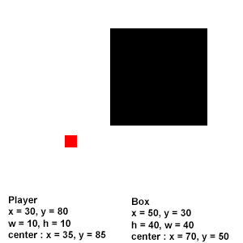
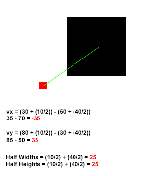
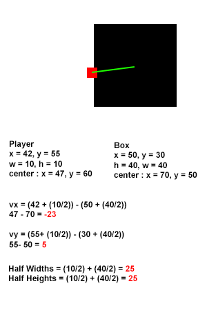
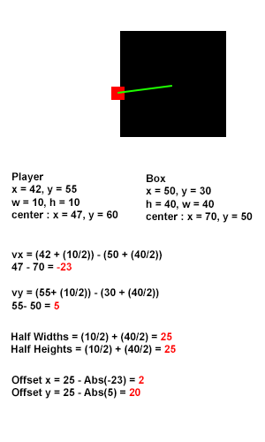

Wow, so its been a while since I've posted anything. I've been kind of busy, and was forcing myself not to post anything unless it was going to be part two of the tutorial. With that said lets begin! For all the code and fully working demo scroll to the bottom.

Last we left off we had a pretty complete demo where we could run and jump around the screen. Now we are going to add some objects that the player can actually collide into!

Lets add an array called boxes to hold the objects well be doing collision checks against, and lets block the player from falling out of the screen by using our objects.

```javascript
var boxes = []

// dimensions
boxes.push({ x: 0, y: 0, width: 10, height: height });
boxes.push({ x: 0, y: height - 2, width: width, height: 50 });
boxes.push({ x: width - 10, y: 0, width: 50, height: height });

```

The above code sets up three boxes to enclose our game world. If you remember from the last tutorial we are checking coordinates directly to keep the player within the bounds, however since we are adding collisions we can just let our collision function handle that for us.

Lets got ahead and add some logic to draw the boxes so you can see them. Add the following code to your update function between clearRect and ctx.fillStyle = "red".


```javascript
ctx.fillStyle = "black"; ctx.beginPath();

for (var i = 0; i < boxes.length; i++) {
    ctx.rect(boxes[i].x, boxes[i].y, boxes[i].width, boxes[i].height);
}

ctx.fill();
```

You should now see some thick black boxes on the left, right, and bottom of your canvas. Now lets actually make the player collide against them!

So Im going to give a pretty brief primer of the collision method we are using. We are going to be checking two objects against each other, the player, and a box. We will do this by checking if they intersect. If they intersect then they must be colliding. Since we are working on a platformer we need one more piece of information, from which direction is the player colliding? Go ahead and add the below function, it does just that!

```javascript
function colCheck(shapeA, shapeB) {
    // get the vectors to check against
    var vX = (shapeA.x + (shapeA.width / 2)) - (shapeB.x + (shapeB.width / 2)),
        vY = (shapeA.y + (shapeA.height / 2)) - (shapeB.y + (shapeB.height / 2)),
        // add the half widths and half heights of the objects
        hWidths = (shapeA.width / 2) + (shapeB.width / 2),
        hHeights = (shapeA.height / 2) + (shapeB.height / 2),
        colDir = null;

    // if the x and y vector are less than the half width or half height,
    // they we must be inside the object, causing a collision
    if (Math.abs(vX) < hWidths && Math.abs(vY) < hHeights) {
        // figures out on which side we are colliding (top, bottom, left, or right)
        var oX = hWidths - Math.abs(vX), oY = hHeights - Math.abs(vY);
        if (oX >= oY) {
            if (vY > 0) {
                colDir = "t";
                shapeA.y += oY;
            } else {
                colDir = "b";
                shapeA.y -= oY;
            }
        } else {
            if (vX > 0) {
                colDir = "l";
                shapeA.x += oX;
            } else {
                colDir = "r";
                shapeA.x -= oX;
            }
        }
    }
    return colDir;
}
```

The code is easy to figure out if you stare at it for a bit, but Ill go ahead and give a quick explanation of whats going on. First we need to calculate the current vector from the center of our objects, which is done in the very beginning.



The player and box object at their current positions ready to be checked to see if they are colliding.

The above image shows the player and one of our boxes. We can tell they aren't currently colliding but lets step through to see how the function figures it out.



Showing the vector calculation and half width, half height calculations.

Above shows the values we end up with for the vector, half widths, and half heights. The function checks the absolute values of the vector to see if they are less than the half width, and half height. If they are there is a collision. As you see from above our vector needed an x component of 25 or less, along with the y. Since they our values were both 35 (remember we check the absolute value meaning the -35 turns to 35) that means we are too far away and are currently not intersecting.

Now lets take a look at an example where the player and the box are intersecting.



The player and the box are now intersecting since the vector components are less than the half width and half height.\[/caption\]

The above uses the same dimensions for the box and player, all we did was move the player closer to the box. The values for the x and y component of the vector come out to less than 25, meaning a collision has occurred. Now using this information we can actually get which side the collision occurred on. To do this we need to first figure out the offset vector, meaning how far are we into the other object. The below illustration shows how we do that.



Calculating the offset vector after a collision has occurred.

So now we have the offsets, what do we need to do with them? First we check if the x components offset is greater than the y. If so that would tell us we either collided with the top or bottom of the object, because the assumption is the greater penetration is not actually \*in\* the object since we would have caught it much sooner. In our case the y offset is much greater meaning we collided with the left or right of the object and since our original vectors X is a positive number, it means it was on the left. If we were on the right side our x value would have came out positive due to the x coordinate of the player being greater than the x coordinate of the box.

Now we need to move the objects outside of each other, if we don't then they will just go further inside one another. This is very easy since we already have the offsets, and since we determined we collided on the left side, we move our box to the left by 2.

Alright so you have this collision function.. what the heck do you do with it? All you need to do is add the following inside the drawing loop for your boxes.

```javascript
 var dir = colCheck(player, boxes[i]);
```

Now we need to add a couple more things before we can actually do anything with the collisions. Add the property grounded, and sliding to your player object and set it false initially. Since we are going to have different things to jump off of we need to know if we are on solid ground or not, or if we should keep falling raising. Your player object should now look like this.

```javascript
player = {
   x: width / 2,
   y: height - 5,
   width: 5,
   height: 5,
   speed: 3,
   velX: 0,
   velY: 0,
   jumping: false,
   grounded: false
},

```

Lets go ahead and add the check to our jumping condition, change your jump key condition to the following.

```javascript
    if (keys[38] || keys[32]) {
        // up arrow or space
        if (!player.jumping && player.grounded) {
            player.jumping = true;
            player.grounded = false;
            // We're not on the ground anymore!!
            player.velY = -player.speed * 2;
        }
    }
```

By looking at that you can see we can only jump if we are on the ground and are currently not jumping, and every time we jump set grounded to false. We also need to set grounded to false before we do the collision check every time so our player can fall off ledges, add the following right before the box loop.

```javascript
player.grounded = false;
```

Now lets go ahead and remove the following from your code, since we are going to be using our collision system instead of hard constraints when keeping the player in the canvas.

```javascript

    if (player.x >= width - player.width) {
        player.x = width - player.width;
    } else if (player.x <= 0) {
        player.x = 0;
    }

    if (player.y >= height - player.height) {
        player.y = height - player.height;
        player.jumping = false;
    }
```

We just removed what told us our player isn't jumping anymore! We need to add some of that logic back in somewhere else! Add the following into your update function inside the box loop where you call the colCheck function.

```javascript

    if (dir === "l" || dir === "r") {
        player.velX = 0; player.jumping = false;
    } else if (dir === "b") {
        player.grounded = true;
        player.jumping = false;
    } else if (dir === "t") {
        player.velY *= -1;
    }
```

As you can see from that, if the collision direction is on the left or right we stop the player from moving left or right, if its on the bottom we set grounded to true since our feet have touched some sort of ground, and if its top, we just reverse the current force of our jump since we hit our head on the ceiling. You could just as easily make velY 0 but it feels a bit floaty to me.

The last thing you need to do is put the following code right after the box loop.

```javascript

if(player.grounded){
    player.velY = 0;
}

player.x += player.velX;
player.y += player.velY;
```

Delete the previous occurrence of player.x += player.velX, and player.y += player.velY. Go ahead and run it! If there are no errors the player should not fall through the world and should be able to run and jump around.. acting just like our previous demo!.. wait, so we did all that work just to make it like the last demo? Of course not, lets add some boxes right under the section where we declared our first set of boxes.

```javascript

    boxes.push({ x: 120, y: 10, width: 80, height: 80 });
    boxes.push({ x: 170, y: 50, width: 80, height: 80 });
    boxes.push({ x: 220, y: 100, width: 80, height: 80 });
    boxes.push({ x: 270, y: 150, width: 40, height: 40 });
```

Now go ahead run around and jump!

The entire program should look like the following

```javascript

(function () {
    var requestAnimationFrame = window.requestAnimationFrame ||
    window.mozRequestAnimationFrame ||
    window.webkitRequestAnimationFrame ||
    window.msRequestAnimationFrame;

    window.requestAnimationFrame = requestAnimationFrame;
})();

var canvas = document.getElementById("canvas"),
    ctx = canvas.getContext("2d"),
    width = 500,
    height = 200,
    player = {
        x: width / 2,
        y: height - 15,
        width: 5,
        height: 5,
        speed: 3,
        velX: 0,
        velY: 0,
        jumping: false,
        grounded: false
    },
    keys = [],
    friction = 0.8,
    gravity = 0.3;

var boxes = [];

// dimensions
boxes.push({ x: 0, y: 0, width: 10, height: height });
boxes.push({ x: 0, y: height - 2, width: width, height: 50 });
boxes.push({ x: width - 10, y: 0, width: 50, height: height });

boxes.push({ x: 120, y: 10, width: 80, height: 80 });
boxes.push({ x: 170, y: 50, width: 80, height: 80 });
boxes.push({ x: 220, y: 100, width: 80, height: 80 });
boxes.push({ x: 270, y: 150, width: 40, height: 40 });

canvas.width = width; canvas.height = height;

function update() {
    // check keys
    if (keys[38] || keys[32]) {
        // up arrow or space
        if (!player.jumping && player.grounded) {
            player.jumping = true;
            player.grounded = false;
            player.velY = -player.speed * 2;
        }
    }

    if (keys[39]) {
        // right arrow
        if (player.velX < player.speed) {
            player.velX++;
        }
    }

    if (keys[37]) {
        // left arrow
        if (player.velX > -player.speed) {
            player.velX--;
        }
    }

    player.velX *= friction; player.velY += gravity;

    ctx.clearRect(0, 0, width, height);
    ctx.fillStyle = "black";
    ctx.beginPath();

    player.grounded = false;
    for (var i = 0; i < boxes.length; i++) {
        ctx.rect(boxes[i].x, boxes[i].y, boxes[i].width, boxes[i].height);

        var dir = colCheck(player, boxes[i]);

        if (dir === "l" || dir === "r") {
            player.velX = 0;
            player.jumping = false;
        } else if (dir === "b") {
            player.grounded = true;
            player.jumping = false;
        } else if (dir === "t") {
            player.velY *= -1;
        }
    }

    if(player.grounded){
        player.velY = 0;
    }

    player.x += player.velX;
    player.y += player.velY;

    ctx.fill();
    ctx.fillStyle = "red";
    ctx.fillRect(player.x, player.y, player.width, player.height);

    requestAnimationFrame(update);
}

function colCheck(shapeA, shapeB) {
    // get the vectors to check against
    var vX = (shapeA.x + (shapeA.width / 2)) - (shapeB.x + (shapeB.width / 2)),
        vY = (shapeA.y + (shapeA.height / 2)) - (shapeB.y + (shapeB.height / 2)),
        // add the half widths and half heights of the objects
        hWidths = (shapeA.width / 2) + (shapeB.width / 2),
        hHeights = (shapeA.height / 2) + (shapeB.height / 2),
        colDir = null;

    // if the x and y vector are less than the half width or half height,
    // they we must be inside the object, causing a collision

    if (Math.abs(vX) < hWidths && Math.abs(vY) < hHeights) {
        // figures out on which side we are colliding (top, bottom, left, or right)
        var oX = hWidths - Math.abs(vX),
            oY = hHeights - Math.abs(vY);

        if (oX >= oY) {
            if (vY > 0) {
                colDir = "t";
                shapeA.y += oY;
            } else {
                colDir = "b";
                shapeA.y -= oY;
            }
        } else {
            if (vX > 0) {
                colDir = "l";
                shapeA.x += oX;
            } else {
                colDir = "r";
                shapeA.x -= oX;
            }
        }
    }
    return colDir;
}

document.body.addEventListener("keydown", function (e) { keys[e.keyCode] = true; });

document.body.addEventListener("keyup", function (e) { keys[e.keyCode] = false; });

window.addEventListener("load", function () {
    update();
});

```

[Link to the code on jsfiddle](http://jsfiddle.net/loktar/da9cP/)
