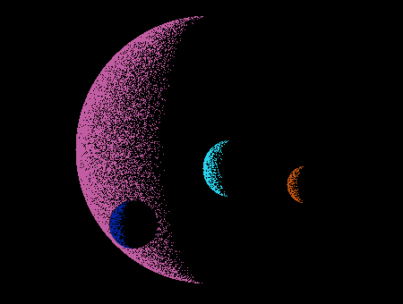
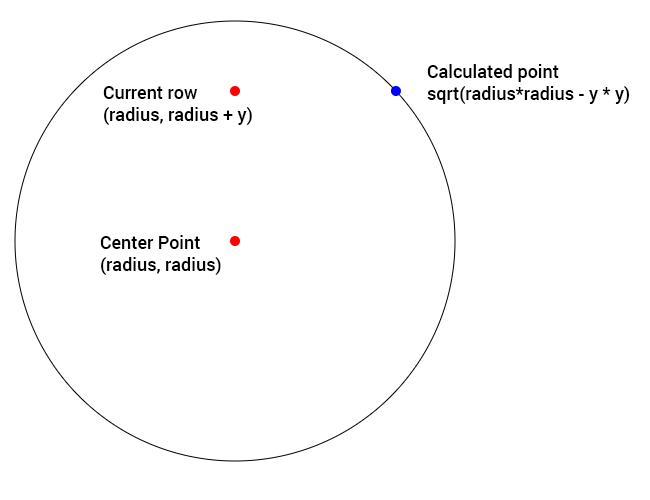
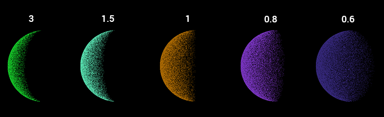

I was checking out some old books the other day and I came across Commodore Step by Step Graphics Vol 3. It had an interesting looking screenshot for a bit of code, which showed shaded spheres entirely made of points. I thought the effect would look cool if multiple ones were layered over each other to look like planets and moons. So I converted the Basic over to JavaScript using the canvas element to replicate the effect.

This is what is produced with the code.

[](http://www.somethinghitme.com/wp-content/uploads/2013/08/Planets-with-points-CodePen.png)

So how exactly is this effect achieved?

[Full page result on codepen](http://cdpn.io/zEhDB)

The following function is what's used to generate the planets.

```javascript
function drawPlanet(rad, xc, yc, color) {
    color = color || { r: 0, g: 100, b: 160 };
    ctx.fillStyle = "#000"; ctx.beginPath();
    ctx.arc(xc, yc, rad, 0, Math.PI \* 2);
    ctx.fill();
    ctx.closePath();

    ctx.fillStyle = `rgb(${color.r},${color.g},${color.b})`;

    var x1 = parseInt(Math.sqrt(rad * rad - y * y));
    for (var x = -x1; x < x1; x++) {
        var n = parseInt(Math.random() * x1) / 1.5;
        if (n > x1 + x) {
            ctx.fillRect(x + xc, y + yc, 1, 1);
        }
    }
}
```

The function drawPlanet takes four parameters. Radius, center x, center y, and the color of the planet. First a solid black arc is created so we can get a proper layering effect, otherwise dots would bleed through and the planets would blend together.

The loop from -rad to rad is where everything takes place. Each iteration as we go down the circle we find out how long the row is from the center x and y position to the edge of the circle. Thanks to [@yutt](https://twitter.com/yutt) for pointing me in the right direction.

We have two points to go from, our Radius (center point), and the Y. So using Pythagoras Theorem (a^2 + b^2 = c^2) we have a and c we can figure out b.

[](http://www.somethinghitme.com/wp-content/uploads/2013/08/radfig1.png)

[Try the fiddle out to see how it works.](http://jsfiddle.net/loktar/yJhLu/)

We have the point from radius, radius+y to the edge of the circle. Now we are able to iterate from -x to x and get every pixel between the edges of the circle for this row.

Now that we had the width of the row we’re on and can iterate over each pixel, the next step is to determine what pixels we want to show and what pixels we want hidden. That is done in the following section of the function drawPlanet.

```javascript
    for (var x = -x1; x < x1; x++) {
        var n = parseInt(Math.random() * x1) / 1.5;
        if (n > x1 + x) {
            ctx.fillRect(x + xc, y + yc, 1, 1);
        }
    }
```

The variable n stores a random number between 0 and x1. Next to determine if we plot the point we check if n is greater than x1 + x. So points would only be plotted if n is greater than x+x1 meaning x \*has\* to cross the barrier, making it more likely points are plotted towards the end of our loop since x would be getting closer to x1 x+x1 would almost be double x1 making it very likely points will be ploted. If we just stopped there we would get a cool effect. Pixels would be randomly plotted for half of the planet. That is where the example in the commodore book ended. However I wanted to get a more spherical effect. All that we need to do for that is divide the value a bit.

```javascript
    var n = parseInt(Math.random() * x1) / 1.5;
```

I use a default of 1.5 what this does is decreases our random number generated even further making it less likely to plot points farther from the edge. And since the value of x1 follows the width of the circle as it goes down we get a cool spherical shading effect.

Below is an example of the shading you get with difference values for the divisor.

[](http://www.somethinghitme.com/wp-content/uploads/2013/08/planet-phases.png)

And that's pretty much all there is to it. A pretty simple effect that uses some cool math and a bit of random to pull off.

<iframe height="300" style="width: 100%;" scrolling="no" title="Planets with points" src="https://codepen.io/loktar00/embed/zEhDB?height=300&theme-id=690&default-tab=js,result" frameborder="no" allowtransparency="true" allowfullscreen="true">
  See the Pen <a href='https://codepen.io/loktar00/pen/zEhDB'>Planets with points</a> by Loktar
  (<a href='https://codepen.io/loktar00'>@loktar00</a>) on <a href='https://codepen.io'>CodePen</a>.
</iframe>
