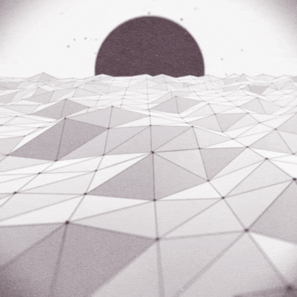

There's a really interesting [competition the creator of jsbin is running](http://remysharp.com/2013/08/14/jsbin-5th-birthday/). The competition involves recreating some pretty amazing gifs (mostly mathmatical based) using Javascript, CSS, and HTML. I couldn't help but try my hand at a few of the gifs. As of this writing I have successfully (mostly anyway) reproduced four of the images.

## Wavey gif

[Wavey gif Demo](http://jsbin.com/otusog/2/)

## Crazy Crosshatch Switching gif

[Crazy Crosshatch Switching Demo](http://jsbin.com/akorem/5/)

## P-Wave/Compression Wave

[P-Wave/Compression Wave Demo](http://jsbin.com/ojiwex/2/)

Finally my favorite and the one I did the most work on so far

## Rough Seas

[JS Bin](http://jsbin.com/oFoZaJe/1/embed?live)

Im sure Ill try my hand at a few more before the competition is over. But I might need to take a break after the last one, it was pretty tough.
