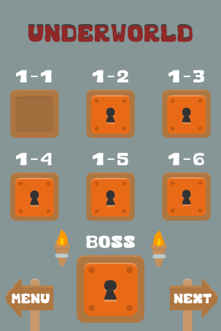
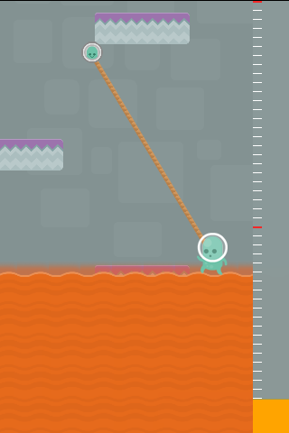
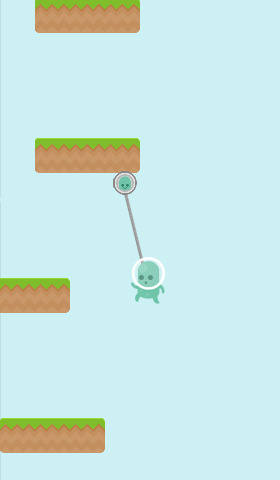
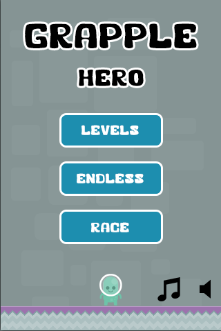

I've been furloughed from my job (government contractor) so I've had a bit of free time on my hands the last 2 weeks. I decided to start and hopefully in a reasonable amount of time finish a full fledged html5/canvas game.

The name of the game is Grapple Hero, check out a few of the wip screenshots.

If anyone has played my old [js1k entry](http://js1k.com/2010-first/demo/755)  you'll recognize the game play immediately. Your character cannot move any way but using his grapple. Once your grapple makes a connection you are shot up into the air where you need to grapple again or you'll fall (sometimes to your death). [I created a website for the game](http://grapplehero.com/)  where you can play the most current demo build, which involves you trying to escape from lava.

I plan on releasing it on Windows, Linux, as a standalone executable, on Android via cacoonjs, on the Google app store, and Desura (hopefully).

Its also been added to IndieDB check it out :)

