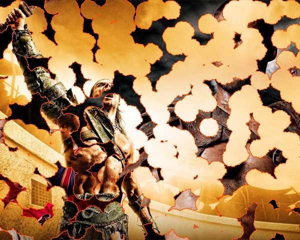
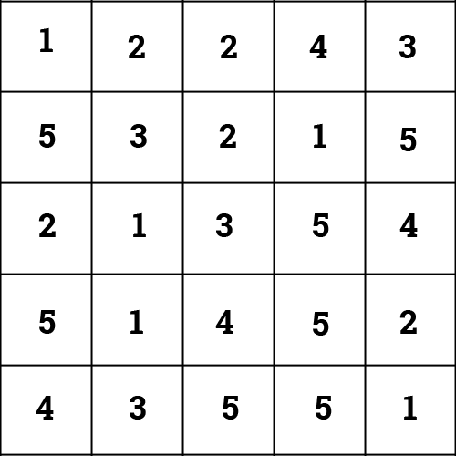
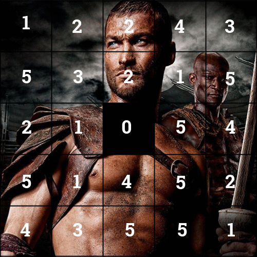

This explanation doesn't show any code more of just an overview of how to achieve a simple but cool looking effect.

I've seen variations this effect used in different places, one of the more recent examples I can think of is the loading screens from Red Orchestra 2. RO2's effect definitely uses a different method than mine but it gave me an idea to try something similar. I ended up with a similiar effect using pixel manipulation, and a tiny bit of Cellular Automaton.

[This is what I ended up with.](http://cdpn.io/kriFg "Burn Away Effect on Codepen") (heh yeah I'm a huge Spartacus fan)

[Edit view with code](http://codepen.io/loktar00/pen/kriFg)

## How the effect works

The explanation of the effect is really simple. I basically thought of each pixel as fuel.  So to determine how long each pixel should “burn” we create a 2D array where each element represents a pixels fuel value we do this by assigning a random value.

The effect works by decrementing the value of all elements which neighbor an element whose value is 0. So to start the effect we need to set an element's value to 0.

There is one gotcha to be aware of. If you don’t have someway of flagging elements whose value has been changed in the current cycle you will end up with a burn effect that goes very fast, and also tends to go to the right or left depending on how you loop through the elements. This speed issue is due to the fact that some elements will have more than one neighbor whose value is 0, in that case we still only want to reduce the value once.

## Animation of the effect in progress

If you want to add a cool effect to make it look like a flame or possible something is eating the elements you just need to color the elements that neighbor an element whose value is 0, as seen in my demo with the color option.
