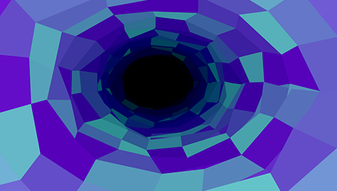
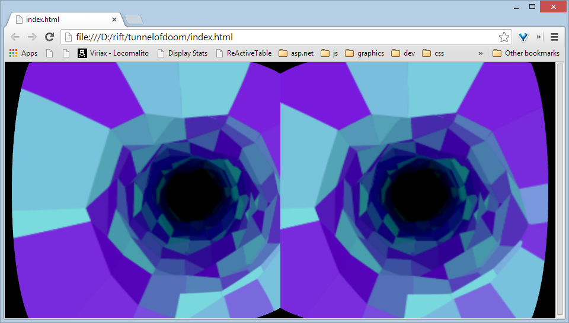

I have neglected to write for a while, have worked at 3 different jobs since my last post and things have finally settled down. I figured I would start back up with something pretty simple I did tonight.

My son was [looking at my tunnel of doom demo](http://codepen.io/loktar00/pen/Alqkb) and said it would be awesome on the Oculus Rift. So I figured I would try porting it. After a quick search I came across the [oculus bridge project](https://github.com/Instrument/oculus-bridge/). The thing that interested me most was the CSS demo which uses some shaders to warp the screen for the rift. All I needed to do was add a canvas into each eye and I had a rift enabled demo.

There is one drawback currently chrome doesn't support filters for accelerated layers so I had to keep my canvas size down in order for it to work, but with some up-scaling the [effect turned out pretty cool](http://codepen.io/loktar00/pen/gpuLE).

