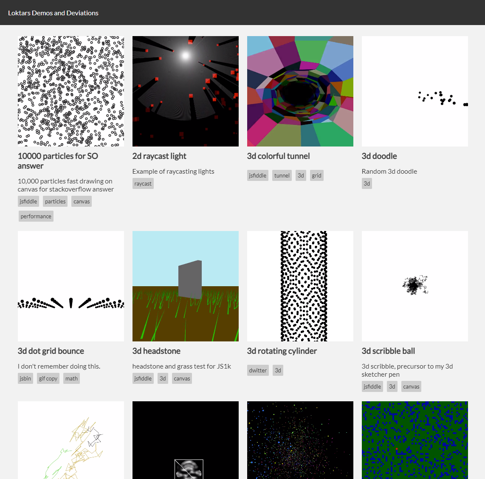

I've been on a weird archiving kick lately, most recently downloading *all* of my gog installers for example and storing them locally and on a backup drive. This need or want for archiving spread to my demo's and bits of code I've wrote over the years. I realized a lot of the small projects I found pretty neat were on jsfiddle, codepen, jsbin or dwitter. I decided to copy all of them and put them into a single [project here](https://loktar00.github.io/demos-and-deviations/), [source code here](https://github.com/loktar00/demos-and-deviations).

The idea is to get this project to a point where I can hit a "new demo" button and start coding in the browser like the other solutions out there, with the side benefit of having my changes branched and tracked on github and then automatically generating a video, screenshot or gif and having it up for display. The plan is to use the github api to accomplish the above.

For now however, and in it's current state it's just a nice quick display of the things I've made over the years. This also allows me to lint and fix up some of the demos if I want, however the plan is to for the most part anyway leave them in the state they were in when I created them. I get to see a lot of wonderfully ugly patterns from the past that I don't miss, such as chaining var declarations.

