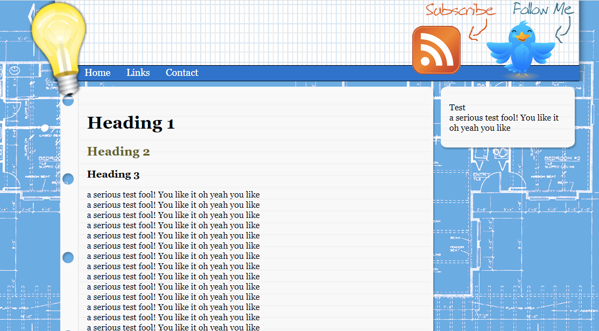
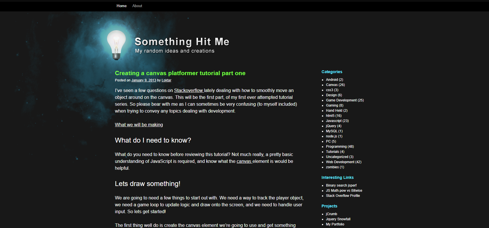
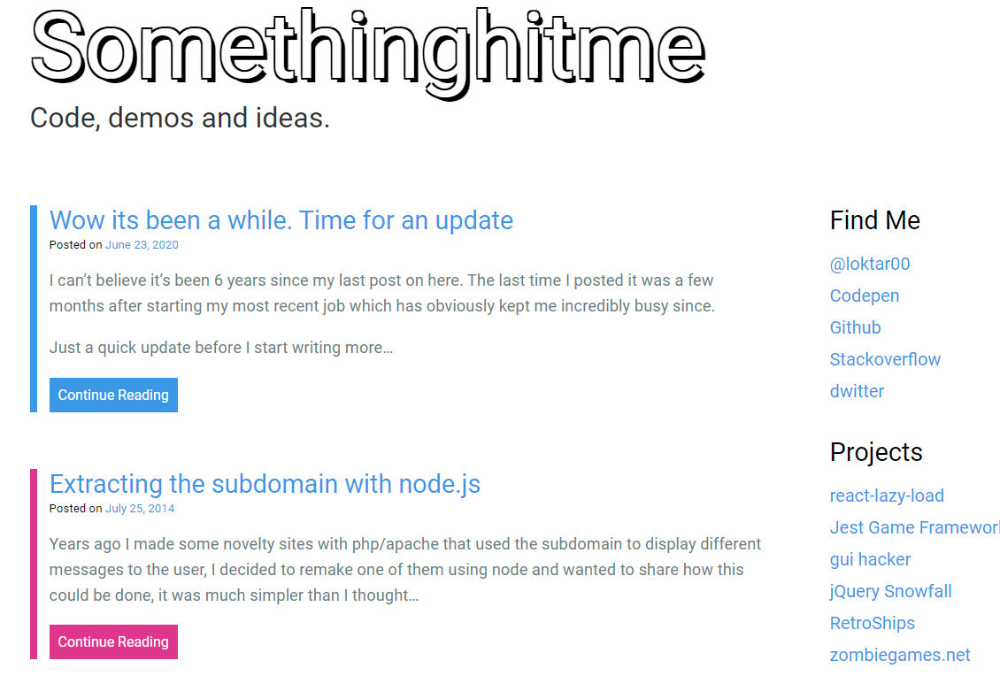

## The Problem

Recently I found myself in between jobs so I had some time on my hands to work on a few of my projects I've let languish over the past few years. I always find myself coming back to this blog since it's low risk so I consider it a playground for me to test things out.

### A bit of history 2009 - 2020

A quick history on this blog and the interations it's had. 

Back in 2009 when blogs were all the rage I threw up a wordpress install made a custom theme and operated using that for years on a shared hosting platform. It worked well for the most part but over the years and with wordpress upgrades and plugins it just became more of a pain. At the end of the day all I really needed were some static pages with my thoughts and images.

## Somethinghitme over the years - 2009, the very first design for the blog. 



## 2010-sh, the very first design (this one might be my favorite).
Just happened to find this on the wayback machine... I am seriously considering going back to this design.



## Prior to todays design, I made them simpler just to change things up.



### 2020

Moving on to 2020 I decided to "upgrade" to Gatsby. There was a bit of hype surrounding it, it used React which I consider myself pretty proficient in, and it generated a static site, exactly what I wanted. This also had the side benefit of allowing me to move hosting to github.

While I found gatsby to be simple for the most part, I just couldn't get over the setup and amount of code needed for something so "simple"... it's something I see everywhere in the development world especially in the front end or Javascript ecosystem. Everything requires a build now.. a build process, multiple dependencies just to get something to show on the page. I went a long with it since the goal was just to convert the site and have some of my older blog posts available. to users.

The issue I had when writing articles most recently is after updating to using Gatsby I found myself spending over an hour or more each time I wanted to add an article since they were so far and few between. I needed to update dependencies to fix issues and of course account for breaking changes. Maybe it's just me, I generally don't run into these issues but Gatsby seemed to always have something going on where the site wouldn't just "build". 

In reality all I wanted to do was sit down write up a markdown file and publish it without thinking about the tech behind the solution.

The other thing I started to get annoyed with was the complexity of wrapping my head around how Gatsby used graphQL with the actual markdown files. I found some cases where weird things would happen with excerpts, and simple things such as using pagination on the main page just seemed overly complex.

## The Solution - present

I've been doing a bit of work in node lately (moreso than usual) so came up with a quick and easy plan to get the blog up and running in a state where I could just sit down and create posts. I decided to create a simple node script to generate the entire site from markdown files and json data. This way I could easily write my articles in markdown and not have to worry about the tech behind the scenes.

The solution I feel is pretty simple overall, there's definitely a lot of room for improvement but my goal was to not spend more than a day on the overall solution so I could actually get to the important part of the site, the content.

I decided to host the site publically this time around, all code is located on my githup profile [here](https://github.com/loktar00/somethinghitme2023).

### The code

The articles all live under `src/blog` and are organized by years, and for the older articles the month and day. The script iterates over the directories grabbing each file and parsing the markdown using [showdown](https://www.npmjs.com/package/showdown) (so far 1 of the total 2 dependencies for the site/).

I continued to use a similar format I had when using gatsby. At the top of each markdown file there's a section to hold metadata associated with each artcile. Here's an example for this one.

```markdown
title: "Recreating this blog with static generation"
date: "2023-06-15"
teaser: "Something in here"
tags: "blog, javascript, static generation, programming"
```

I then parse the markdown when it's being read and extract the information to expose to our templates.

```javasript
    // Grab the information from each file to generate our table of contents and structure
    const pattern = /---([\s\S]*?)---/g;
    const matches = text.match(pattern);
    let pageData = {};

    if (matches) {
        for (const match of matches) {
            const contentBetweenDelimiters = match.replace(/---/g, '').trim();
            contentBetweenDelimiters.split('\n')
                .forEach(line => {
                    const data = line.split(':');
                    const key = data[0].trim();
                    const value = data[1].trim().replace(/"/g, '');
                    pageData[key] = value;
                });
        }
    }
```

#### Additional parsing

I do have some `gists` and quite a few code blocks, so I went with a pretty simple approach of parsing out the code blocks, those are just replaced with prism for syntax highligting. 

For gists it's a straight forward approach again, I have considered breaking this out into a sort of "plugin" system to parse out and convert other things, such as prettier images with captions.

```javascript
    // Embed gists.
    const gistPattern = /\\\[gist id=(?<id>[\d]*)\\\]/g;
    for (const match of textToConvert.matchAll(gistPattern)) {
        textToConvert = textToConvert.replace(match[0], `<script src="http://gist.github.com/${match.groups.id}.js"></script>`);
    }
```

For anything else I allow for vanilla markup and scripts so I can just drop in some html if I need to. Since the sites generated I'm not too worried about security.

#### Templating

For templating I went with a pretty simple solution, our second dependency is ejs, which I've always been a pretty big fan of. 

Here's a quick example of the index page. I use partials for most things duplicated.

```javascript
<!DOCTYPE html>
<html lang="en" data-theme="light">
    <%- include('/src/templates/partials/head', {title: `${data.main.title} - ${data.main.tagline}`}) -%>
    <body>
        <div class="layout">
            <%- include('/src/templates/partials/header') -%>
            <main class="main">
                <section class="primary">
                    <%- 
                        data.articles.map(article => 
                            `<a href="/${article.path}">
                                <article class="article">
                                    <h3>${article.title}</h3>
                                    <small> 
                                        ${new Date(article.date).toLocaleDateString('en-us', { timeZone: 'UTC', weekday:"long", year:"numeric", month:"short", day:"numeric"})}
                                    </small>
                                    <p>
                                        ${article.teaser}
                                    </p>
                                    <footer class="article__footer">
                                        <span class="read-more">Read Article →</span>
                                    </footer>
                                </article>
                            </a>`
                        ).join('') 
                    -%>
                </section>
                <section class="secondary">
                    <%- include('/src/templates/sidebar', {sidebar: data.sidebar}) -%>
                </section>
            </main>
            <%- include('/src/templates/partials/footer') -%>
        </div>
        <script src='/js/main.js'></script>
        <script type='module' src='/js/starscape.js'></script>
    </body>
```

#### Other configs

For things like the side bar I follow the approach of creating a few json files to hold the data. 

Here's an example of the sidebar json file.

```json
{
    "sidebar": {
        "sections": [
            {
                "title": "Find Me",
                "links": [
                    {
                        "title": "@loktar00",
                        "url": "https://twitter.com/loktar00"
                    },
                    /// Ect.
                ]
            },
            {
                "title": "Projects",
                "links": [
                    {
                        "title": "react-lazy-load",
                        "url": "https://github.com/loktar00/react-lazy-load"
                    },
                  /// Ect.
                ]
            }
        ]
    }
}
```

The node script just combines all the JSON together (to include article data from the markdown files), and creates a structure that's passed to the ejs templates to build the page. 

#### Styling

For styling I'm just using vanilla css, I might change that to SCSS since I'm a huge fan of nesting (I can't wait for the day that's supported natively!).

### Hosting

For hosting I'm sticking with github pages. Each commit to the main branch triggers an action which builds everything to github pages so I have a pretty worry free experience.

### Improvmements

Beyond just making improvements for mobile, I'm not in love with the main page design when it comes to layout, definitely needs more images. I also do want to go back to a pages main page and need to add tags so I can organize articles in the side bar a bit like I used to with wordpress. Might as well add a timeline as well. As of right now I'm overall happy, not bad for a days worth of work.

### Conclusion

Will I end up writing more? Who knows, I feel like I only come to this blog when I don't have an existing project and I want to sink time into something that feels relevant. I've told myself I need to start documenting what I do more in the hopes of helping others however in the back of my mind I wonder how relevant any of this will be with tools like chatGPT. Only time will tell.
