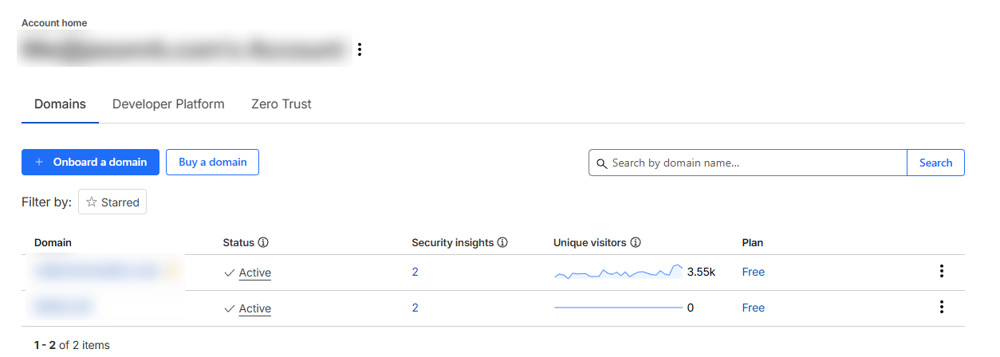
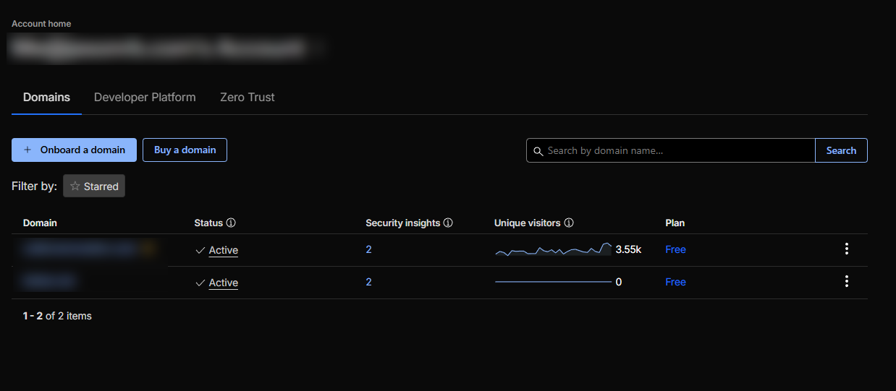
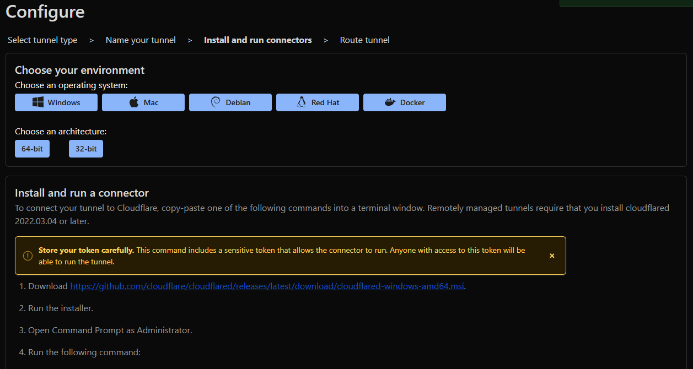
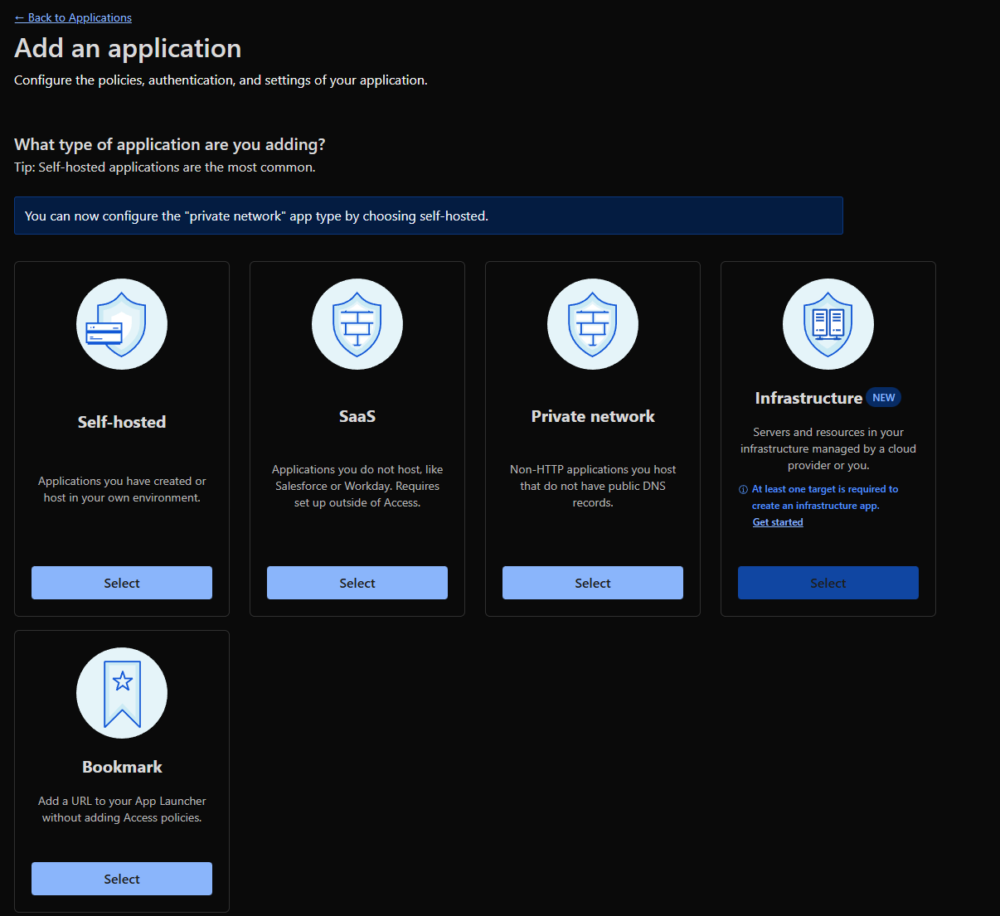
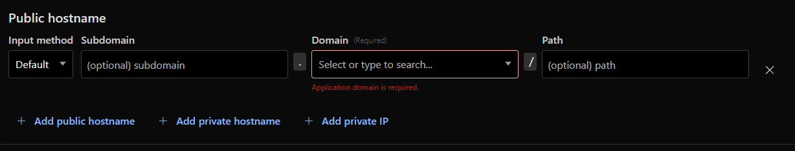
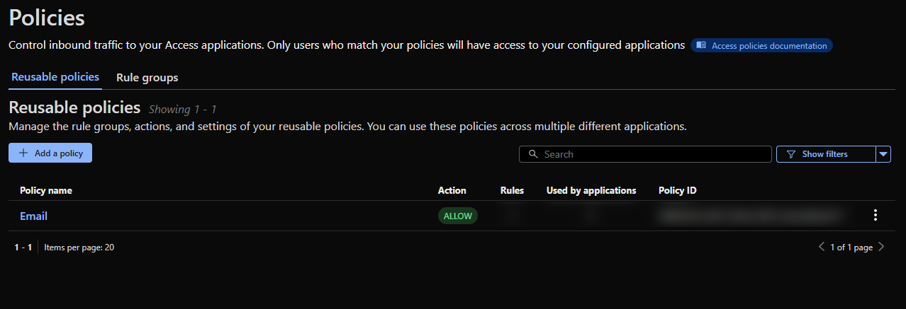
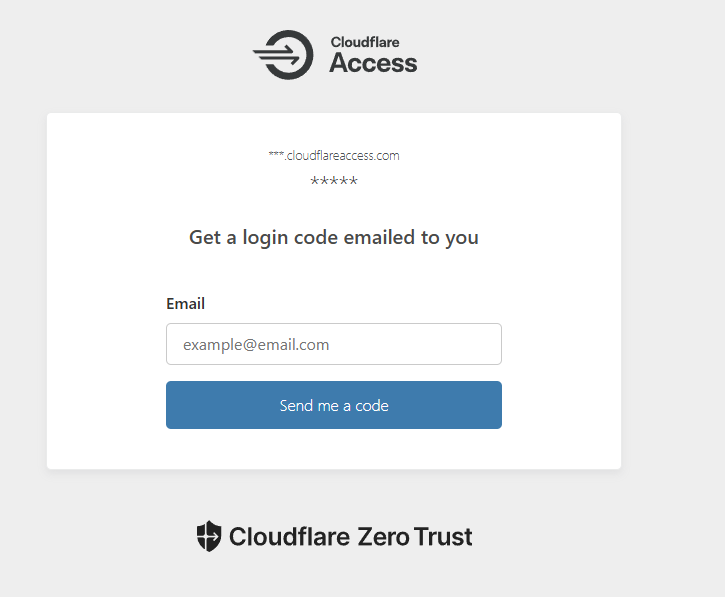

### What you need before you start

- A Cloudflare account (free)
- A domain you can point to Cloudflare
- A machine/container inside your network to run `cloudflared`
- The local URL of the service you want to expose (like `http://localhost:5678`)

## The Scenario

I've been running local LLMs for over a year at this point. It's been great.

Recently my family asked for access, including a couple who don't live in the house anymore.

There's a bunch of ways to do this. In the past I've used ngrok, or I just set up a VPN on my home router and gave my kids access. None of them were as straightforward as what I found using Cloudflare.

> Note: I'm keeping this post focused on getting a tunnel working and putting Access in front of it.
> I'm not covering WAF rules, rate limiting, hardening the service itself, or anything beyond basic access control.

### Enter Cloudflare

The short version is: Cloudflare Tunnel gives you the connection, and Cloudflare Access puts a simple login wall (in my case email) in front of it.

I've been on a recent Cloudflare kick. Granted of course I started RIGHT before their most recent outages, but putting those aside I've been incredibly happy with their services.

I've used them on my wife's real estate site to block a few regions that have been needlessly beating up the site along with default AI blocking. Additionally, at my day job I directed the engineering team to look into it as a possible solution to some spam we were dealing with. After acknowledging this would be a good fit, we implemented it across all of our publicly hosted applications and not only has it significantly decreased spam (practically to 0), it also cached a few services, increasing speed across the applications significantly, over 50% in some cases.

## Local Services and Tunnels

As I mentioned I run a few local AI instances on Proxmox servers in my home (I'll share specs and setups in a future post), however they're all accessible locally within the network. I really never had a major reason to expose any of them until I recently got n8n up and running, and had family members ask if they could access some of my local services since I have some RAG implementations set up for the Bible and other knowledge sets.

The rest of this post will go over setting up a Cloudflare tunnel, and putting email access in front of it, along with the why behind it.

### Step 1 Cloudflare Account

If you don't have a Cloudflare account, set one up (this is all free by the way!).

I won't go through the setup here. However, what you're going to want to do once set up is look for Cloudflare One / Zero Trust, and get an account set up through that as well. The default free plan is 50 users, and it's free.

### Step 2 Domain Name

Get a domain name and connect it to Cloudflare.

This part is incredibly simple and one of the strong points of Cloudflare. All settings you currently have will be added and proxied.

Be sure to look them over to ensure all settings have been properly picked up. Once you've confirmed everything looks right, you'll see nameservers provided by Cloudflare. If you're hosting your domain via a third party provider you just need to update your nameservers with them and Cloudflare will take over.

> Note: Any hosting endpoints, websites, etc. will continue working just as they were before. This isn't a traditional nameserver swap where you lose everything. Cloudflare now has control but it proxies everything that was existing prior.

### Step 3 Zero Trust setup

If you set up Cloudflare One / Zero Trust previously to this step you'll see the Zero Trust option. If not, search for Zero Trust and you'll be prompted to set up an account. You have to add a form of payment. However, it is free as long as you stay within the requirements (something we will be doing within this tutorial).

Once you select Zero Trust, go to Networks and Overview. You'll see Manage Tunnels. This is where you want to go.

### Step 4 Setting up the Tunnel

For the first screen you'll have two choices. Select Cloudflared.

You may be asking how this works. If not, feel free to skip the following random story I interject.

How this all works is similar to other services which offer similar features. You have a service which runs inside of your network letting Cloudflare know who you are and where you're located.

Funny story, an old friend of mine rolled his own version of this back in the early 2000's. From work he wanted to connect to his IRC server, but like most of us was on a dynamic IP from his ISP that switched more often than he'd like. He had a script which would run and FTP to an external server he owned a txt file with only the IP address of his home network. His IRC script would always hit that txt file in order to get to his home hosted IRC server, and when I say IRC server in reality it was something a few of us did. It was a server running our IRC clients we'd SSH into so all logs and records stayed off of work machines.

Back to the setup, once you choose Cloudflared you'll have to provide a tunnel name. This can be anything. It's only the label within Cloudflare.

Choose the environment you're in. In my case it's Debian. You'll get the commands or executable to run based on the platform and architecture chosen. It's incredibly simple. The main thing they call out, and of course is always a good idea, is don't share your token with anyone. In Debian I chose the option to run as a service, since if I boot my container I want it all working by default.

### Step 5 Setting up the Domain and pointing to your instance

This is probably the biggest potential "gotcha" with the entire setup. In your subdomain use any valid subdomain and choose the domain you added earlier.

For service this is the most important. For Type, if you're actually running HTTPS choose HTTPS here. However, if you're running HTTP locally (I am on most of my instances) choose HTTP here. Cloudflare will still use HTTPS so you don't need to worry.

For URL this is one of the biggest gotchas I've seen when looking at tutorials and setups (comments in videos on Reddit, etc., and really the reason I decided to write this). Use the URL your service is using.

#### The gotcha

Use the URL your service is actually listening on, not your public IP.

- If your service is `http://localhost:8080`, put `http://localhost:8080`
- If your service is `http://0.0.0.0:1234`, put `http://0.0.0.0:1234`

Do not put your external IP here. Also don't swap in `192.168.x.x` if the service is bound to `0.0.0.0`.

Once you're set, hit save. Test your tunnel. It should work almost immediately.

> It's important to note just because a tunnel is set up doesn't mean you lose your original internal way to access the application or service. If you commonly use an internal static IP address that will continue to work and bypass Cloudflare.

Now you _could_ stop here. However, your service is accessible by anyone and everyone over the internet. Even for instances like OpenwebUI for example which do have internal authentication methods, I really don't feel like having it exposed, and I don't feel like dealing with potential network bottlenecks if I happened to suddenly get hit with tons of requests (although Cloudflare should filter most out).

So it's a good idea to set up Access control, which Cloudflare One also provides, and it's incredibly easy to set up.

### Step 6 Access Control

Navigate to Access Controls and Policies. This is where you can set up reusable policies to apply to any of your Applications.

Go to add Policy. Within this screen you will have the option for a whole plethora of authentication methods, to include facial scanning. Personally I just chose Email, which is a whitelist of email addresses you provide. You can also control how often you want the token to expire as well. I left mine set at 24 hours.

### Step 7 Setup an Application

Now that you have an access control policy set up, you're going to want to set up an application pointing to your tunnel so you can actually use the access control policy.

Navigate to Access Controls/Applications and click to Add an application. Since this is for a local service, choose Self-hosted.

You'll be presented with the screen below. Give it a name to identify it, choose your session duration and select `Add Public Hostname`

Optional subdomain is the one you used when setting up your tunnel above, and choose the domain which has the subdomain on it.

Next go down a little to Access Policies, click `Select Existing Policies` and choose the one you set up earlier.

Finally test your URL and you should be presented with a screen similar to below. This will depend on the authentication method chosen. In this case it's email.

### Conclusion

That's it! You should be all set up. Now your local services are exposed but access is controlled through your Cloudflare security policy. Note once a user goes through this they will also need to authenticate with whatever your service has as well. For example, if it's openwebui they'll still need to login to their openwebui account if they weren't already.
