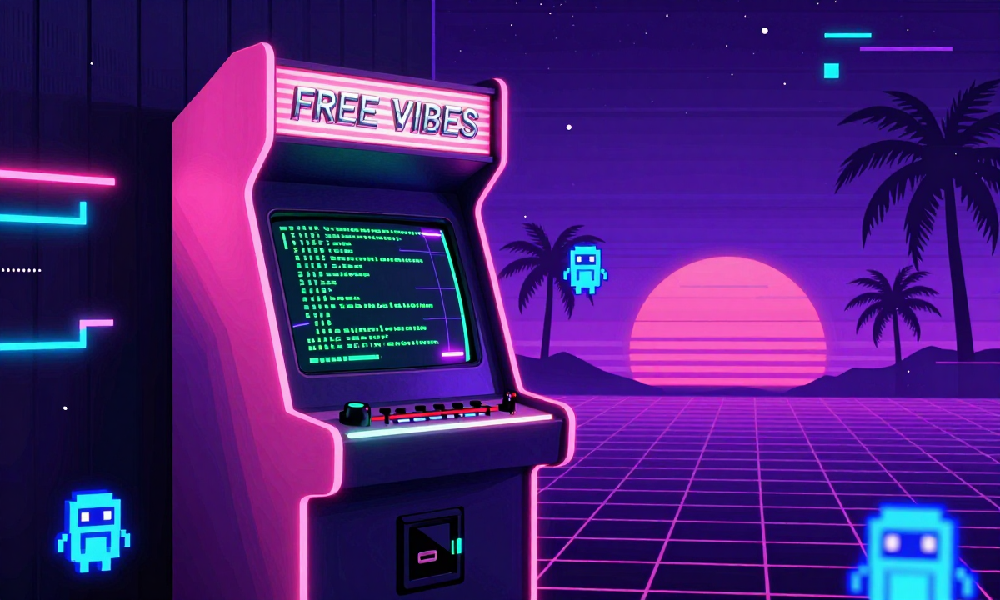
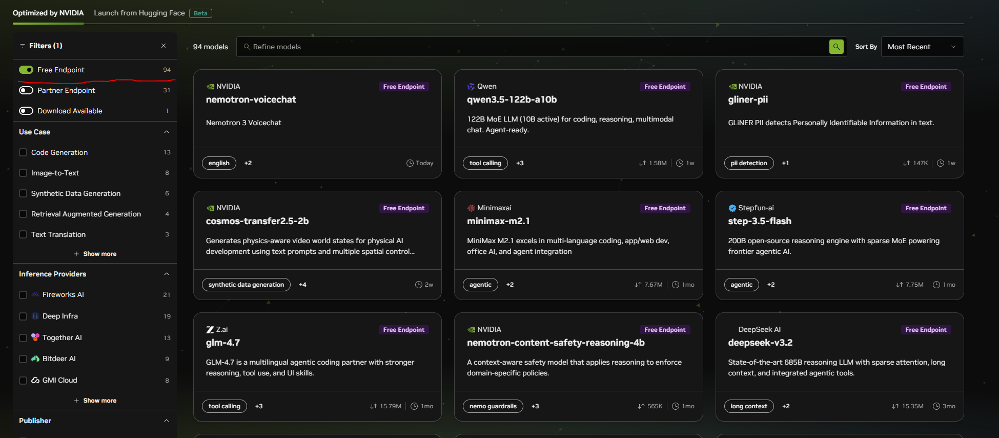
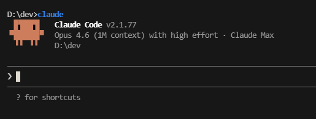
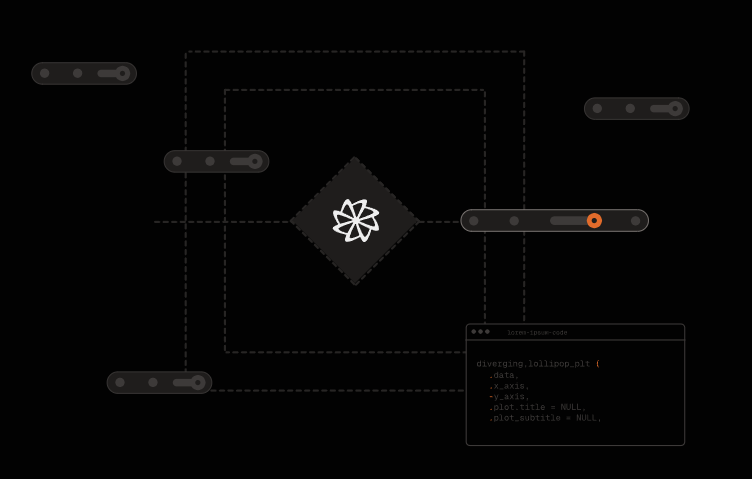

## The barrier to entry is... gone?

Everyone's talking about vibe coding, everyone's also talking about thousands in tokens, thousands of dollars in local setups. If you're just getting started and want to experiment, and have a budget of $0, where can you even begin? Good news you can get started for the low low price of $0!

There are free models available right now from multiple providers. Some are cloud-hosted, some you can run locally if you have the hardware. Pair them with the right coding harness and you've got a working setup without spending a dime.

This isn't a step-by-step walkthrough. I'll cover the options, the trade-offs, and point you to the right links. You're smart enough to follow setup docs.

## The Free Model Providers

### OpenRouter - The easiest on-ramp

[OpenRouter](https://openrouter.ai) acts like a gateway. One account, one API key, access to a ton of models. Some of them are free.

Sign up, grab your API key, and browse the free models here: [https://openrouter.ai/models?q=free](https://openrouter.ai/models?q=free)

A couple worth looking at right now
**NOTE: this was written 3/17/2026 these will change and can go away at any time. I'll try to update when this happens.**

* **[Healer Alpha](https://openrouter.ai/openrouter/healer-alpha)** - 262k context window, solid for longer sessions
* **[Hunter Alpha](https://openrouter.ai/openrouter/hunter-alpha)** - 1 trillion parameter model, designed specifically for AI agents

One thing to know: individual free models get hammered. They're rate-limited and sometimes just unavailable because everyone's hitting them. OpenRouter has a **"free model router"** option that spreads your requests across whatever free models are currently available. It's more reliable than pinning to a single model.

There's a caveat floating around that you might need $10 of credit in your OpenRouter account for the free tier to work. I've seen it work without it, but if you're getting errors that's a good first thing to try.

The nice part about OpenRouter is the upgrade path. If you outgrow free models you can switch to something like **MiniMax MoE 2.5** which is strong for coding and way cheaper than Claude Opus. Same API key, just change the model name.

### NVIDIA Build - Free tier, serious models

NVIDIA has their own model hosting at [build.nvidia.com/models](https://build.nvidia.com/models). Create an account, get an API key, pick a model.

Worth checking out:
* **GLM 5**
* **Kimi K-25**
* **MiniMax**

**Make sure to select the Free Endpoint filter**

I [wrote about running GLM-4.7-Flash locally](/blog/2026/01/20/vllm-tuning-for-low-memory/) with vLLM and all the VRAM tuning that goes with it. With NVIDIA's API you can hit these same model families without owning any hardware at all. That's a big deal if you just want to get coding.

### LM Studio & llama.cpp - The power-user path

This section is for people who have GPUs and want full control. No rate limits, no internet dependency, no one else's terms of service.

**[LM Studio](https://lmstudio.ai/)** is the easy button for running models locally. Download it, search for a model, click run, and you've got an OpenAI-compatible API on localhost. It has a clean UI for managing models and tweaking settings without touching the command line. If you've never run a local model before, start here.

**[llama.cpp](https://github.com/ggml-org/llama.cpp)** gives you maximum flexibility. It truly pools your VRAM across GPUs which means if you have multiple cards you can use all of it. I covered the differences between vLLM and llama.cpp in my [vLLM tuning article](/blog/2026/01/20/vllm-tuning-for-low-memory/). The short version: llama.cpp pools your VRAM and is more forgiving for single-user setups. vLLM is faster for multi-user but each GPU is its own island.

**[ollama](https://ollama.com/)** Ollama is great for beginners... however it has some issues only recommended if the above options just don't work.

If you're going the local route, the [Qwen 3.5 models](https://huggingface.co/collections/unsloth/qwen35) are worth looking into. The 9B is very capable and can run on a 3060 with 12GB of VRAM. The 27B is a step up in quality but you'll need something beefier like a 24GB card. Both punch well above their size for coding tasks.

The trade-off is obvious. You need the hardware. But you own the whole stack and nobody can rate-limit you.

## The Harnesses - Where the vibes actually happen

A model by itself doesn't do much for you. You need something that connects it to your codebase, your terminal, your files. That's what these tools do.

### Claude Code

This is what I use daily. I [wrote about creating local plugins for it](/blog/2026/01/31/creating-local-claude-code-plugins/) and it's become central to how I work. The same tool can be pointed at free models through OpenRouter or NVIDIA.

The setup is a `settings.json` with your API key, base URL, and model name. You can scope it to a single project or set it globally. The [official docs on third-party model configuration](https://docs.anthropic.com/en/docs/claude-code/settings) cover the specifics.

I'll be honest though. Claude Code works best with Claude models. Free models won't give you the same experience as Sonnet or Opus. But for learning how vibe coding works and building smaller projects, it's more than enough to get your feet wet.

### Factory Droid

[Factory Droid](https://factory.ai/) is another agent harness similar to Claude Code. It connects to your codebase and lets you work through natural language, same concept but a different tool with its own take on the workflow.

It supports OpenRouter, LM Studio, and any OpenAI-compatible endpoint. Worth trying alongside Claude Code to see which one clicks for you.

Honestly... it's also much cooler looking ;).

## The honest trade-offs

Let me be real about what you're getting here.

Free models will not perform like Sonnet 4.6, Opus, or Codex 5.4, but you don't always NEED that level anyway, it can be like using a Bazooka to hunt a bunny... sure it will work but a slingshot would as well.

Another thing to keep in mind you'll hit rate limits. Models will be unavailable at peak times. Responses will be slower and less accurate on complex tasks.

Local models need hardware. If you don't have a decent GPU you're looking at cloud options only.

But for learning, prototyping, side projects, and just seeing what this whole vibe coding thing is about? Free is more than enough to get started. And the upgrade path is smooth. Start with OpenRouter's free tier, and when you're ready to pay for better performance the switch is changing one line in your config.

## Cheap (not free) Next steps when you want to VIBE HARDER!

* [The Best one by far (and the cheapest) - z.ai](https://z.ai/subscribe?ic=CASNIDH7IX) - Referral link for $10 a month and it gives me some free credits! Z.ai is responsible for the GLM models.
* [Kimi Code](https://www.kimi.com/code) - Another great option starting at $20 a month.
* [OpenAI Codes](https://chatgpt.com/codex) - The $20 option is surprisingly good and limits are doubled until April 2nd 2026!

## Where to go from here

**Model providers:**
* [OpenRouter](https://openrouter.ai) - [Free models](https://openrouter.ai/models?q=free)
* [NVIDIA Build](https://build.nvidia.com/models)
* [LM Studio](https://lmstudio.ai/)
* [llama.cpp](https://github.com/ggml-org/llama.cpp)

**Coding harnesses:**
* [Claude Code](https://docs.anthropic.com/en/docs/claude-code)
* [Factory Droid](https://factory.ai/)
* [Codex CLI](https://github.com/openai/codex)

**My previous articles if you want to go deeper:**
* [vLLM Tuning For Low Memory](/blog/2026/01/20/vllm-tuning-for-low-memory/) - getting the most out of local models with limited VRAM
* [Creating Local Claude Code Plugins](/blog/2026/01/31/creating-local-claude-code-plugins/) - extending your harness with custom tools
